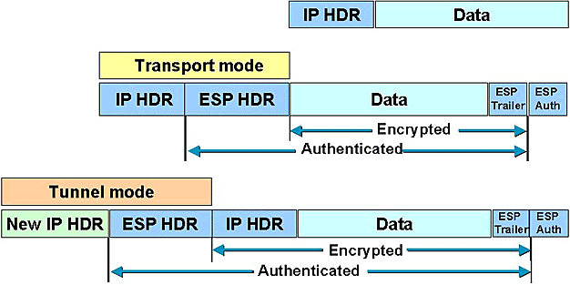
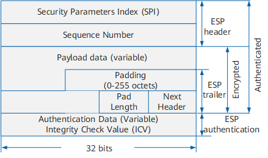

安全的定义：1. 加密 2. 完整性校验 3. 源认证

对称加密算法：DES 3DES AES RC4  
特点：同一个密钥用于加密和解密  
用途：加密大块数据  
优点：1. 加解密速度快 2. 密文紧凑(密文比明文大不了多少)  
缺点：1. 密钥管理复杂(分发密钥很困难) 2. 不支持数字签名

非对称加密算法：RSA DH ECC  
特点：公钥加密私钥解，私钥加密公钥解  
用途：仅用于密钥交换(加密密钥)和数字签名(加密散列值)  
优点：1. 密钥管理简单(自己持有私钥，公钥放在网络上开放下载) 2. 支持数字签名  
缺点：1. 加解密速度慢 2. 密文不紧凑(密文比明文大很多)

经典解决方案：  
本地随机产生一个对称密钥对明文进行加密，产生密文，然后用对方的公钥来加密这个对称密钥，产生一个加密后的密钥，把密文和加密后的密钥打包发给对方，对方用自己的私钥解开加密的对称密钥，然后用对称密钥解开密文得到明文  
https就是用的这种方法，举例来说：
当打开https网站，浏览器信任网站证书并得到网站的公钥，然后浏览器随机产生对称密钥，用网站的公钥加密这个对称密钥发给网站服务器，后续浏览器和服务器之间就用这个对称密钥加解密实际数据，https通常使用RC4作为对称加密算法

散列算法：MD5 SHA  
散列算法的特点：1. 固定大小(不定长输入定长输出) 2. 雪崩效应(哪怕原文修改一位，散列值就有巨大变化) 3. 单向(不可逆向从散列值得到明文) 4. 冲突避免(几乎不可能有两个不同的数据计算出来的散列值相同)

数字签名：  
明文做哈希得到摘要，用自己的私钥加密这个摘要，得到的加密后的摘要即为数字签名  
A把明文和数字签名发送给B，B用A的公钥解密数字签名得到明文摘要1，至此验证了发送方A的身份，并把得到的明文做哈希得到摘要2，如果两个摘要相同则数据是完整没有被篡改的

数字证书：  
由共同信任的第三方机构颁发，证明某个人/机构/设备的身份有效性  
数字证书包含：证书持有者的基本信息，证书持有者的公钥，证书有效期，认证机构的数字签名  
数字证书解决了最后一个问题：确定公钥的持有者是谁

注：数字签名可以单独使用，做源认证和完整性校验，只是接收方无法确定发送方的公钥是否合法，但数字证书必须和数字签名一起使用才有意义，光有数字证书没有意义，因为数字证书的作用仅仅是证明证书的持有者是谁

最终解决方案：  
假设A给B发送一个数据  
前提条件：A和B共同信任一个第三方证书颁发机构，并且本地都有该CA的数字证书  
A随机产生一个对称密钥对明文进行加密得到密文，A用B的公钥来加密这个对称密钥得到一个加密后的密钥，A对明文做哈希得到摘要，用自己的私钥加密这个摘要生成数字签名  
A把 1. 密文 2. 加密后的对称密钥 3. 数字签名 4. 自己的数字证书 一起发送给B  
B收到A发来的这4样东西，首先用CA的证书里的CA的公钥来验证A的数字证书(用CA的公钥解密A的数字证书里CA用自己私钥做的数字签名，能解密就证明A的数字证书是有效的，并且B得到A的公钥)，B再用自己的私钥解密加密后的对称密钥，得到明文的对称密钥，然后用该对称密钥解密密文得到明文，再对明文做哈希得到摘要1，再用A的公钥解密A的数字签名得到明文摘要2，能解密数字签名，证明该数据是A发送的，对比两个摘要如果一样则证明数据是完整没有被篡改的

身份验证和完整性校验的两种实现方法：1. 密钥化的散列(HMAC) 2. 数字签名和数字证书

IPSec两个协议  
IKE：用于协商和认证，目的端口UDP500  
ESP：用于加密实际流量，协议号50

IPSec两种模式  
Transport mode：原IP包全网可路由，加密点等于通信点  
Tunnel mode：原IP包不可全网路由，加密点不等于通信点

Transport mode和Tunnel mode封装图解


ESP封装图解  


ESP头部  
SPI：32bit，标识一个IPSec SA，用来处理这个包  
序列号：32bit，用来防重放攻击  
ESP尾部  
垫片：变长，因为对称加密算法都是块加密，比如DES以8个字节的块来加密数据，所以要补齐块边界  
Pad Length：1字节，指定垫片长度  
Next Header：1字节，指定ESP里面封装的是什么协议  
ESP认证  
Authentication Data：12字节(取HASH值的前96bit)

ESP包外出处理：
1. 插入ESP头部和尾部，如果是传输模式，需修改IP头部的协议字段(改成50)
2. 加密原始数据包和ESP尾部
3. 对整个ESP包(包括ESP头部，原始数据，ESP尾部)做HMAC放在ESP认证字段
4. 传输模式由于改了协议字段，需重新计算IP头部校验和

ESP包进入处理：
1. 看SPI字段，检查相应的SA是否存在
2. 检查序列号是否有效
3. 对数据包做HMAC进行完整性校验和源认证
4. 对数据包进行解密

关于分片：  
实验证明IPSec是先分片，再加密  
如果IPSec收到一个数据包在加密后会超过出接口的MTU，他会先把原始数据包分片，然后对每一个分片加密，接收端路由器收到的是一个个完整的ESP包，解密后直接转发，由最终目的地负责重组装

SA  
IPSec建立成功后会产生2个SA，ISAKMP SA和IPSec SA，这两个SA都由IKE协商产生  
ISAKMP SA：一个双向SA(入方向流量和出方向流量用同一个SA处理)，包含IKE处理相关细节(IKE第一阶段的5,6个包和第二阶段的3个包都是加密的)  
IPSec SA：每个感兴趣流产生两个单向SA，包含IPSec处理相关细节

SA包含：
1. 序列号
2. 防重放窗口
3. SA lifetime
4. mode(tunnel mode还是transport mode)
5. ESP加密算法和密钥
6. ESP验证算法和密钥
7. Path MTU

IKE  
IKE负责在两个IPSec对等体之间协商一条IPSec隧道，主要有以下工作内容：
1. 协商协议参数(加密算法，哈希算法，认证方式等)
2. 交换DH公共密钥，产生密钥，管理密钥
3. 对双方进行认证

IKE协商分两个阶段，9个包交换，都是UDP包，目的端口UDP500  
IKE第一阶段主模式(6个包交换)：  
1，2个包主要是交换proposal(包括DH组，加密算法，认证方式，哈希算法等)，第一个包发送一堆proposal，第二个包回一个被选择的proposal，这两个包为明文  
3，4个包交换DH公共值和随机数，这两个包为明文，交换以后两边各自生成一个相同的shared DH secret，由pre-shared key和随机数生成SKEYID，再由SKEYID和shared DH secret生成三个key：  
SKEYID_d 用于衍生后续的IPSec密钥资源  
SKEYID_a 用于HMAC提供后续IKE消息的完整性校验和源认证  
SKEYID_e 用于加密后续IKE消息  
5，6个包交换各自的IP地址和哈希值(一堆东西做哈希，包括SKEYID_a，Pre-shared Key，双方都知道的内容等等)，两边对比自己算的哈希值和收到的哈希值，如果一样则认证通过  
从5，6个包开始加上快速模式3个包都是密文，用SKEYID_e加密，用SKEYID_a做HMAC  
第一阶段完成后生成ISAKMP SA  
IKE第二阶段快速模式：  
1，2个包交换哈希值(SKEYID_a再加上一堆东西做哈希)目的是为了再次互相认证，交换proposal：封装方式(ESP)，mode(tunnel还是transport)，加密算法，哈希算法，lifetime，如果开了PFS则还有DH组，DH公共值和随机数，交换感兴趣流(gre over ipsec的感兴趣流的源目地址总是tunnel两端的global IP地址)，交换以后两边生成新的shared DH secret，再混合SKEYID_d一起计算出IPSec加密用的密钥(生成两个对称密钥，一个密钥用于出方向，一个密钥用于入方向，分别对应两个方向的IPSec SA)  
第3个包发起方发送一个哈希值用于确认，接收方收到以后确认快速模式完成  
至此IPSec隧道建立，生成IPSec SA

出方向IPSec处理流程：  
IPSec隧道建立之前：  
数据包到达路由器——查路由——送到出接口——撞上crypto map并匹配感兴趣流则触发IKE协商并建立IPSec隧道——加密重新封装——查路由——送到出接口  
IPSec隧道建立之后：  
数据包到达路由器——查路由——送到出接口——撞上crypto map并匹配感兴趣流——加密重新封装——查路由——送到出接口

入方向IPSec处理流程：  
加密数据包进入接口，不管接口有没有应用crypto map，只看有没有SPI对应的SA，只要本地有SA就可以解密

```
crypto map配置
crypto isakmp policy 10
 encryption aes
 hash md5
 authentication pre-share
 group 2
 lifetime 86400             这是isakmp sa的lifetime，默认86400秒

crypto isakmp key Bechtel1234 address 122.193.111.166

ip access-list extended ITSC_VPN_TRAFFIC
 permit ip 10.1.1.0 0.0.0.255 10.1.2.0 0.0.0.255

crypto ipsec transform-set ITSC_VPN_TRANSFORM esp-des esp-md5-hmac 
 mode tunnel	                                    L2L VPN哪怕两边都敲mode transport，也会自动协商成mode tunnel

crypto map ITSC_VPN_MAP 10 ipsec-isakmp             crypto map汇总的是第二阶段策略，一个接口只能调用一个crypto map，不同的数字代表不同的VPN，密钥由isakmp协商自动生成，也可以手动设置密钥或者由GDOI协议分发
 set peer 122.193.111.166
 set transform-set ITSC_VPN_TRANSFORM
 set pfs group2				                        可选配置
 set security-association lifetime seconds 3600     可选配置，这是ipsec sa的lifetime，默认3600秒
 match address ITSC_VPN_TRAFFIC
 
interface FastEthernet0/0
 crypto map ITSC_VPN_MAP

debug crypto isakmp
debug crypto ipsec

clear crypto isakmp         清isakmp sa
clear crypto sa             清ipsec sa

show crypto isakmp policy
show crypto isakmp sa
show crypto ipsec sa
show crypto session
```

```
isakmp profile配置
crypto isakmp policy 10
 encryption aes
 hash md5
 authentication pre-share
 group 2

crypto keyring ITSC_KEYRING
  pre-shared-key address 122.193.111.166 key Bechtel1234

crypto isakmp profile ITSC_ISAKMP_PROFILE
   keyring ITSC_KEYRING
   match identity address 122.193.111.166 255.255.255.255

ip access-list extended ITSC_VPN_TRAFFIC
 permit ip 10.1.1.0 0.0.0.255 10.1.2.0 0.0.0.255

crypto ipsec transform-set ITSC_VPN_TRANSFORM esp-des esp-md5-hmac 
 mode tunnel

crypto map ITSC_VPN_MAP 10 ipsec-isakmp
 set peer 122.193.111.166
 set transform-set ITSC_VPN_TRANSFORM
 set isakmp-profile ITSC_ISAKMP_PROFILE
 match address ITSC_VPN_TRAFFIC

interface FastEthernet0/0
 crypto map ITSC_VPN_MAP
```

VPN Peer上有NAT对VPN的影响：  
由于NAT先执行，Crypto map后执行，所以要在NAT ACL中把IPSec感兴趣流deny掉，这样感兴趣流就不会被NAT

触发NAT的条件：
1. 穿越路由器的流量
   - 从ip nat inside接口进
   - 从ip nat outside接口出
   - 匹配ACL
2. 路由器自身发起的流量
   - 从ip nat outside接口出
   - 匹配ACL

让感兴趣流不被NAT的一个无聊的解决方案：  
写route-map匹配感兴趣流，set interface loopback，调用在路由器内部接口，由于loopback接口的流量有去有回，所以流量进入lookback接口又从loopback接口出来，再查路由，再从外部接口出，这时路由器认为这个流量是从loopback接口进，从外部接口出，由于不满足NAT条件之一的流量从ip nat inside接口进，所以流量不会被NAT

注：NAT ACL一定不能写permit ip any any  
any any会导致从路由器自身发起的从ip nat outside接口出的流量被NAT

IPSec VPN网络穿越问题：  
1. 两个VPN Peer中间有防火墙：需放行IKE和ESP流量
2. VPN Peer上的ACL对流量的处理：  
    1. 入方向ACL对流量的处理：
       - 流量从调用crypto map的外部接口进入，二层解封装
       - 如果包是明文的反向感兴趣流的流量则drop
       - 先过Inbound ACL，这个ACL放行加密点之间的ISAKMP和ESP流量
       - 解密
       - 再过Inbound access crypto map ACL，这个ACL放行解密后通信点之间的流量(在crypto map下调用，set ip access-group NAME in)
    2. 出方向ACL对流量的处理：
       - 流量匹配到感兴趣流ACL，送到出接口
       - 先过Outbound access crypto map ACL，这个ACL放行加密前通信点之间的流量(在crypto map下调用，set ip access-group NAME out)
       - 加密
       - 再过Outbound ACL，这个ACL放行加密点之间的ESP流量(ISAKMP流量不用放，因为ACL对路由器自身发起的流量不起作用)
       - 流量从调用crypto map的外部接口出去，进行二层封装
3. 两个VPN Peer中间有NAT：  
    1. ESP两种模式穿越NAT过程中的问题：
       - ESP传输模式：如果原始数据包的负载是TCP或者UDP，则任何NAT都过不了，因为TCP/UDP校验和的计算包含了源目IP地址(伪首部)，NAT设备改变了源IP地址，但由于负载被ESP加密，所以NAT设备无法更新TCP/UDP校验和，数据包到达对端设备最终TCP/UDP校验失败
       - ESP隧道模式：一对一NAT可以过，但是PAT过不了，因为ESP没有端口号，无法做端口地址转换  
    2. 解决方法：NAT-T技术，NAT-T工作过程：
       - 第一步确定Peer双方是否都支持NAT-T(IKE第一阶段1，2包交换NAT-T的Vendor ID)
       - 第二步探测两个Peers之间是否有NAT存在(IKE第一阶段3，4包交换两个NAT-D，第一个NAT-D包含源IP和源端口计算出的哈希值，第二个NAT-D包含目的IP和目的端口计算出的哈希值，两边Peer收到对方发来的数据包，再次计算源IP源端口，目的IP目的端口的哈希值，和NAT-D的哈希值比较即可知道中间是否有NAT转换)
       - 如果第二步判断中间有NAT，则从IKE第一阶段5，6包开始，到后面所有的ESP包都被封装到UDP4500端口


研究GET VPN怎么分发秘钥  
GET VPN的用途：加密MPLS VPN，加密DMVPN   
写分片笔记的时候研究加了NAT-T头部的情况   
抓包看iperf包的内容  
