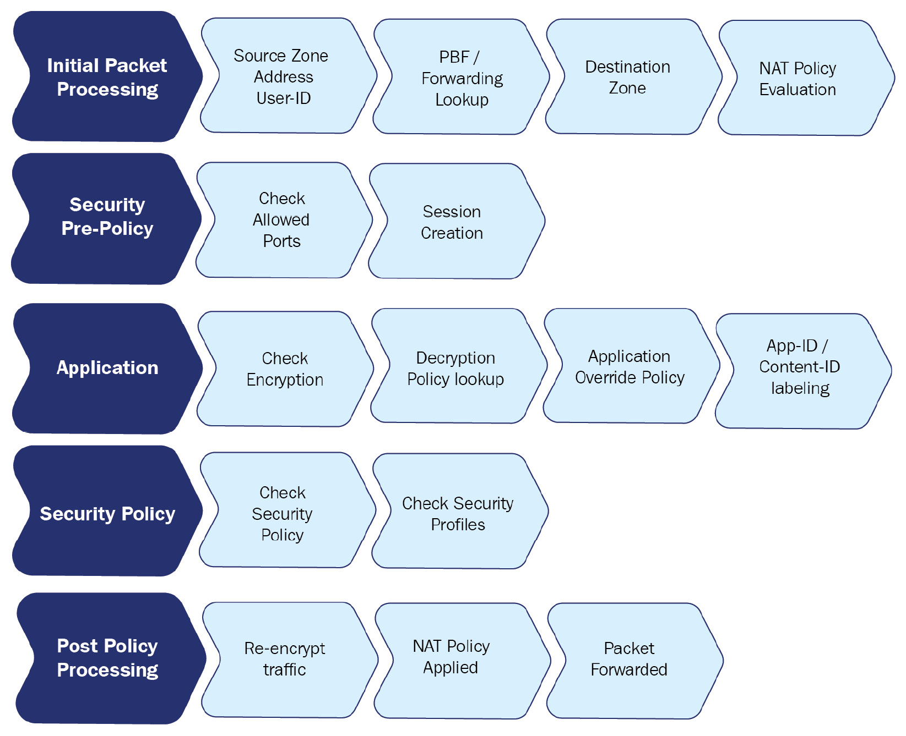

Phases of packet processing

<div STYLE="page-break-after: always;"></div>

## Expected behavior when determining zones

When a packet arrives on an interface, the PBF policy or routing table will be consulted to determine the destination zone based on the original IP address in the packet header.

Let's consider the following routing table:
```
> show routing route

flags: A:active, ?:loose, C:connect, H:host, S:static, ~:internal, R:rip, O:ospf, B:bgp,

       Oi:ospf intra-area, Oo:ospf inter-area, O1:ospf ext-type-1, O2:ospf ext-type-2, E:ecmp, M:multicast

VIRTUAL ROUTER: default (id 1)

  ==========

destination       nexthop       metric flags  interface    

0.0.0.0/0         198.51.100.1  10     A S    ethernet1/1                  

198.51.100.0/24   198.51.100.2  0      A C    ethernet1/1

198.51.100.2/32   0.0.0.0       0      A H                                      

192.168.0.0/24    192.168.0.1   0      A C    ethernet1/2                  

192.168.0.1/32    0.0.0.0       0      A H         

172.16.0.0/24     172.16.0.1    0      A C    ethernet1/3                  

172.16.0.1/32     0.0.0.0       0      A H                                                                     

total routes shown: 7
```

Let's assume ethernet1/1 is the external interface with IP address 198.51.100.2 set to zone external, ethernet1/2 is the DMZ interface with IP address 192.168.0.1 set to zone dmz, and ethernet1/3 is the LAN interface with IP 172.16.0.1 and set to zone lan. The default route is going out of interface ethernet1/1 to 198.51.100.1 as next-hop. There are a few scenarios that will influence how the zone is determined:

- Scenario 1: A packet is received from client PC 172.16.0.5 with destination IP 1.1.1.1. The firewall quickly determines the source zone is lan and a route lookup determines the destination IP is not a connected network, so the default route needs to be followed to the internet. The destination zone must be external because the egress interface is ethernet1/1.

- Scenario 2: A packet is received from client PC 172.16.0.5 with destination IP 1.1.1.1 but a PBF rule exists that forces all traffic for 1.1.1.1 to the next-hop IP 192.168.0.25. As PBF overrides the routing table, the destination zone will become dmz as the egress interface is now ethernet1/2.

- Scenario 3: A packet is received from internet IP 203.0.113.1 with destination IP 198.51.100.2. This is a typical example of what NAT looks like to the firewall: It receives a packet with its external IP address as the destination. From the perspective of the NAT policy, the source zone will be external as the IP is not from a connected network and no static route exists, and the destination zone will also be external as the IP is connected to that interface. From a security aspect, however, once NAT is applied, the destination zone will change to whatever NAT action is applied.  
*IMPORTANT NOTE  
Remember that NAT policy evaluation happens after the initial zones have been determined, but before the security policy is evaluated.*


出厂默认用户名密码：  
Username: admin  
Password: admin


有用的命令：  
show system info

CLI配置management interface
```
configure

set deviceconfig system type static

set deviceconfig system ip-address <IP>

set deviceconfig system netmask <x.x.x.x>

set deviceconfig system default-gateway <IP>

set deviceconfig system dns-setting servers primary <IP>

set deviceconfig system dns-setting servers secondary <IP>

commit
```


配置举例：  
先修改默认的密码，然后进入configure模式，配置management interface
```
admin@PA-220> set password

Enter old password :

Enter new password :

Confirm password :

Password changed

admin@PA-220> configure

Entering configuration mode

[edit] admin@PA-220# set deviceconfig system type static

[edit] admin@PA-220# set deviceconfig system ip-address 192.168.27.5 netmask 255.255.255.0 default-gateway 192.168.27.1 dns-setting servers primary 1.1.1.1 secondary 1.0.0.1

[edit] admin@PA-220# commit

Commit job 2 is in progress. Use Ctrl+C to return to command prompt

...........................................55%....75%.....98%.......................100%

Configuration committed successfully

[edit] admin@PA-220#
```